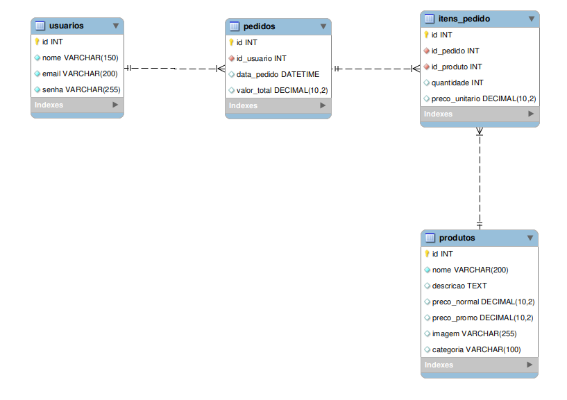
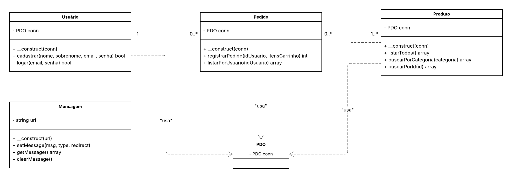

# 🛒 ByteShop - E-commerce Black Friday

Projeto acadêmico de um sistema de E-commerce completo desenvolvido em **PHP Nativo**, utilizando arquitetura **MVC (Model-View-Controller)**, focado na venda de eletrônicos com temática de Black Friday.

O sistema conta com fluxo completo de vendas: Autenticação Segura, Catálogo Dinâmico, Carrinho (Sessão), Simulação de Frete (API), Checkout com Transações ACID, Pagamento via PIX (API) e Dashboard de Vendas.

## 🚀 Funcionalidades

### 👤 Usuário
*   **Autenticação:** Cadastro e Login com **hash de senha (Bcrypt)** para segurança máxima.
*   **Painel:** Visualização personalizada ("Olá, Nome").
*   **Meus Pedidos:** Histórico completo de compras com status, data e itens detalhados.

### 🛍️ Loja e Produtos
*   **Catálogo:** Listagem dinâmica vinda do banco de dados (MySQL).
*   **Filtros:** Busca por nome e categorias (Monitores, Celulares, Games) via parâmetros GET seguros.
*   **Preços:** Exibição de preço "De/Por" com cálculo de desconto automático.

### 🛒 Carrinho e Checkout
*   **Gestão de Sessão:** O carrinho é gerenciado via PHP Session para performance (não ocupa banco até a compra).
*   **API de Frete:** Integração com **ViaCEP** (Fetch API) para preenchimento automático de endereço.
*   **Integridade de Dados:** O fechamento do pedido utiliza **Transações de Banco de Dados (ACID)**. Se falhar a gravação de um item, o pedido inteiro é cancelado (Rollback).

### 💳 Pagamento e Pós-Venda
*   **API de QR Code:** Integração com **QuickChart** para gerar um QR Code PIX dinâmico exclusivo para cada ID de pedido.
*   **Dashboard BI:** Painel interativo integrado com **Google Looker Studio** (conectado a uma base em Planilha) para simulação visual de métricas e KPIs de vendas.

## 🛠️ Tecnologias Utilizadas

*   **Back-end:** PHP 8+ (Nativo) com PDO e Arquitetura MVC.
*   **Banco de Dados:** MySQL / MariaDB.
*   **Front-end:** HTML5, CSS3, JavaScript (Fetch API).
*   **Framework CSS:** Bootstrap 5.3 + Bootstrap Icons.
*   **APIs e Integrações:**
    *   [ViaCEP](https://viacep.com.br/) (Consulta de endereço).
    *   [QuickChart](https://quickchart.io/) (Geração de QR Code).
    *   [Google Looker Studio](https://lookerstudio.google.com/) (Dashboard conectado via Google Sheets).

## Estrutura de Pastas (MVC)

```
/projeto-web-uniruy-atualizado
│
├── assets/                   # Arquivos estáticos (Front-end)
│   ├── css/
│   │   └── styles.css        # CSS personalizado (Dark Mode Black Friday)
│   ├── img/
│   │   └── ...               # Imagens dos produtos
│   └── js/
│       └── api_services.js   # Integração JS com ViaCEP
│
├── config/                   # Configurações do Sistema
│   ├── database.php          # Conexão PDO com MySQL
│   └── url.php               # Definição da BASE_URL (Rota fixa)
│
├── controllers/              # Controladores (Recebem as requisições)
│   ├── AuthController.php    # Processa Login e Cadastro
│   └── CarrinhoController.php # Adiciona/Remove itens e Finaliza Compra
│
├── models/                   # Regras de Negócio e Banco (Classes)
│   ├── Mensagem.php          # Sistema de Flash Messages (Alertas)
│   ├── Pedido.php            # Lógica de Transação e Histórico
│   ├── Produto.php           # Consultas e Filtros de produtos
│   └── Usuario.php           # Lógica de Autenticação e Hashing
│
├── templates/                # Blocos de HTML reutilizáveis (Views parciais)
│   ├── header.php            # Navbar e Lógica de Sessão
│   └── footer.php            # Rodapé
│
├── cadastro.php              # View: Tela de Cadastro
├── carrinho.php              # View: Tela do Carrinho
├── dashboard.php             # View: Painel de Business Intelligence (Iframe)
├── index.php                 # View: Página Inicial
├── login.php                 # View: Tela de Login
├── logout.php                # Script de encerramento de sessão
├── meus_pedidos.php          # View: Histórico de Compras
├── produtos.php              # View: Catálogo de Produtos
└── sucesso.php               # View: Tela de Pagamento com QR Code
```
## Diagramas do Projeto 

### Diagrama ER 



### Diagrama de Classes 



## ⚙️ Instalação e Configuração

### 1. Requisitos
*   Servidor local (XAMPP, WAMP ou Apache no Linux).
*   MySQL.

### 2. Banco de Dados
1.  Abra seu gerenciador MySQL (phpMyAdmin ou Workbench).
2.  Crie um banco de dados chamado `black_friday`.
3.  Importe o script localizado em `database/banco.sql`.

### 3. Configuração da URL (Importante!)
Para evitar erros de redirecionamento, configure o nome da sua pasta no arquivo `config/url.php`:

1.  Abra `config/url.php`.
2.  Edite a variável `$nome_da_pasta`:
    ```php
    $nome_da_pasta = "projeto-web-uniruy-atualizado"; // Coloque o nome EXATO da sua pasta aqui
    ```

### 4. Permissões (Apenas Linux/Mac)
Se estiver usando Linux, garanta permissão de leitura na pasta controllers:
```bash
sudo chmod -R 777 controllers/
```

---

## 👥 Equipe
Projeto desenvolvido para a disciplina de Programação Web.
*   Adam
*   Aryane
*   João Vitor
*   Vitor
*   Rodrigo
